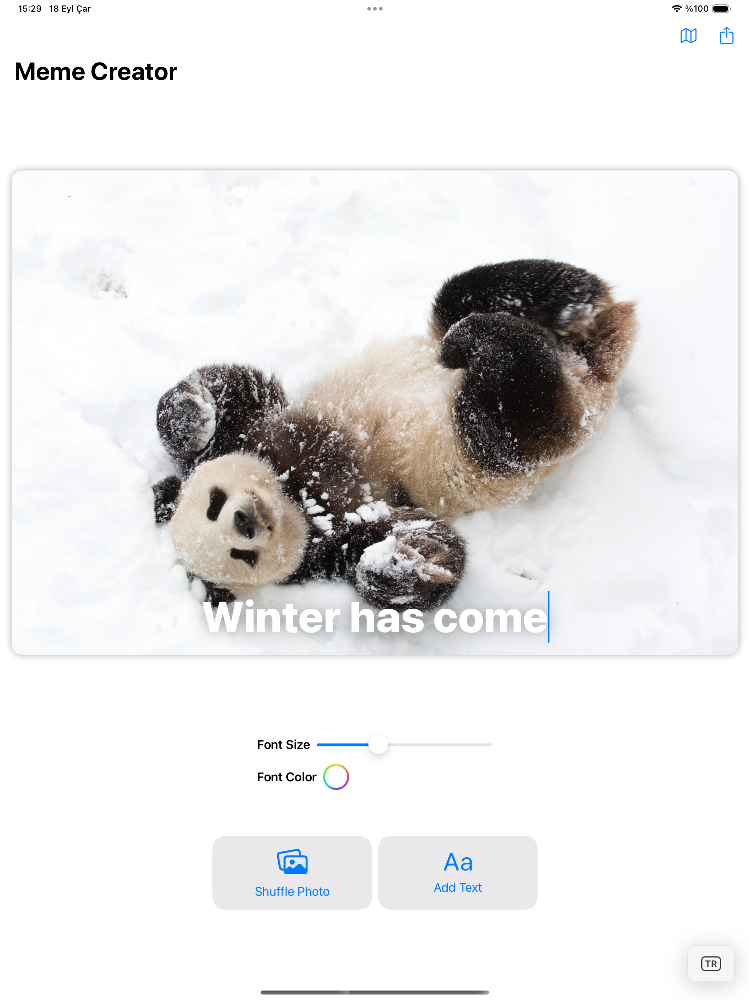

# Meme Creator

<details close>
  <summary>Uygulamaya ait ekran görüntülerini görmek için tıklayın.</summary>
   
</details>

## Teknoloji

SwiftUI

## Özellikler

- Servisten gelen panda fotoğraflarından rastgele bir tanesini seçerek meme oluşturabilmek.
- Yazının boyutunu ve rengini ayarlayabilmek.
- Oluşturulan fotoğrafı paylaşabilmek.
- Servisten gelen pandaları harita üzerinden görebilmek ve detayına bakabilmek.

## Kurulum

Bu depoyu yerel makinenizde klonlayın.

```
git clone https://github.com/ibrahimaykutbas/meme-creator.git
```

### Hazırlık

Projeyi klonladıktan sonra ilgili dizine gidin.

```
cd meme-creator
open MemeCreator.xcodeproj
```

Bu talimatlar, geliştirme ve test amacıyla yerel makinenizde projenin bir kopyasını hazır hale getirecektir.
